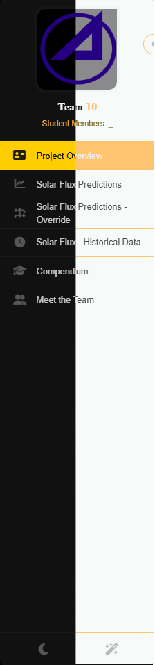
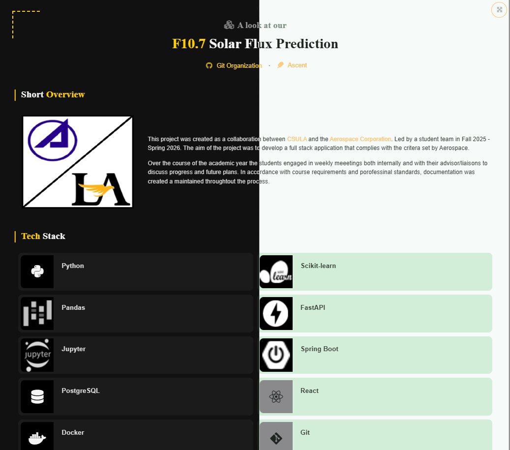
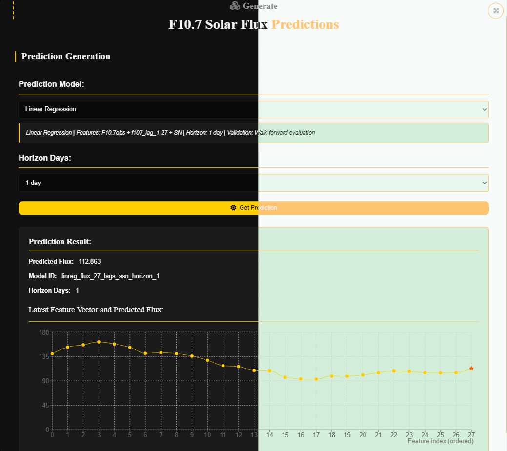
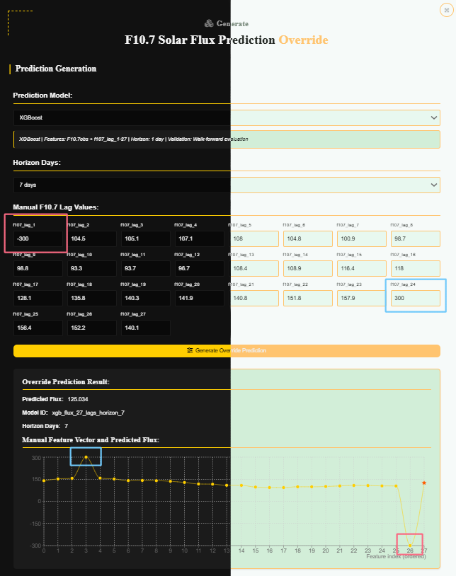
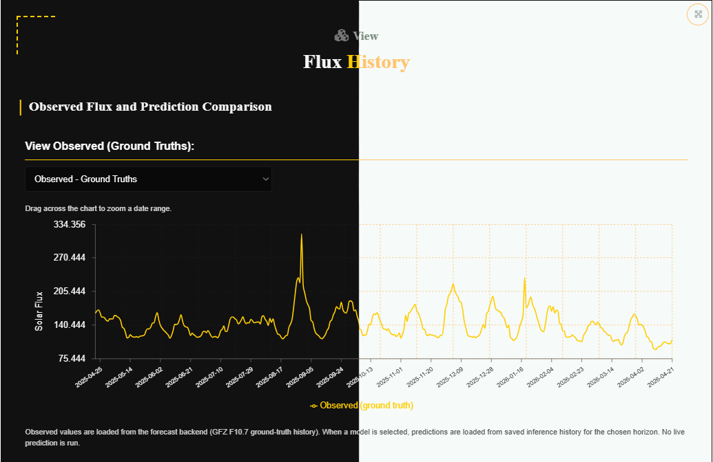
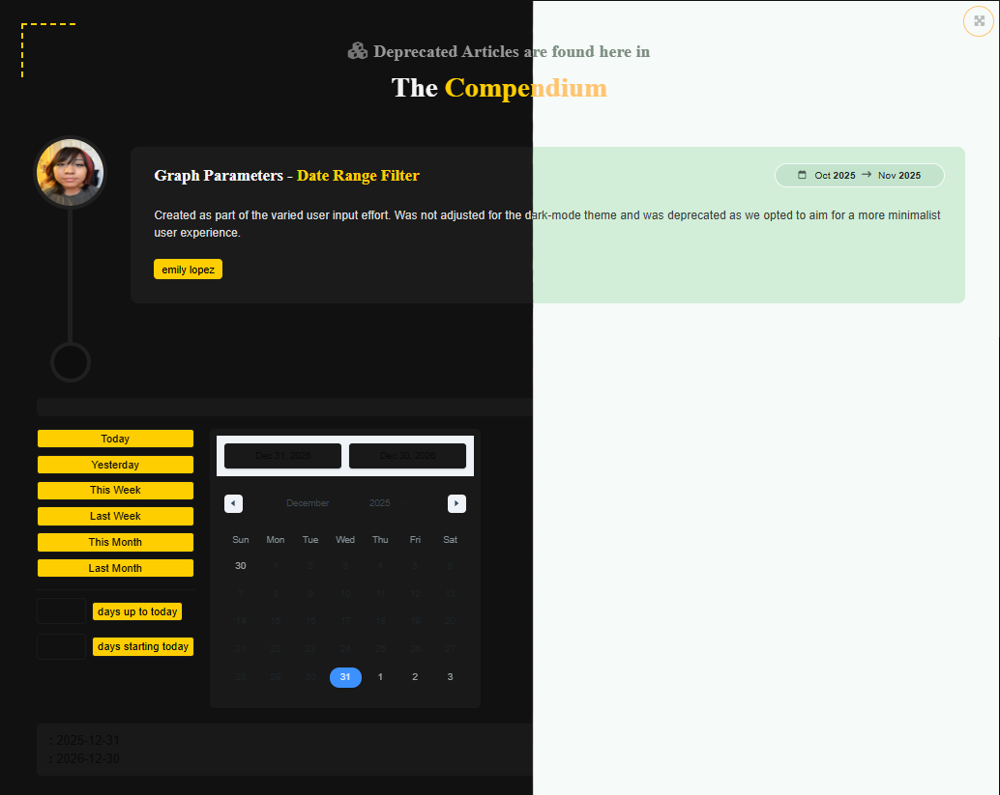
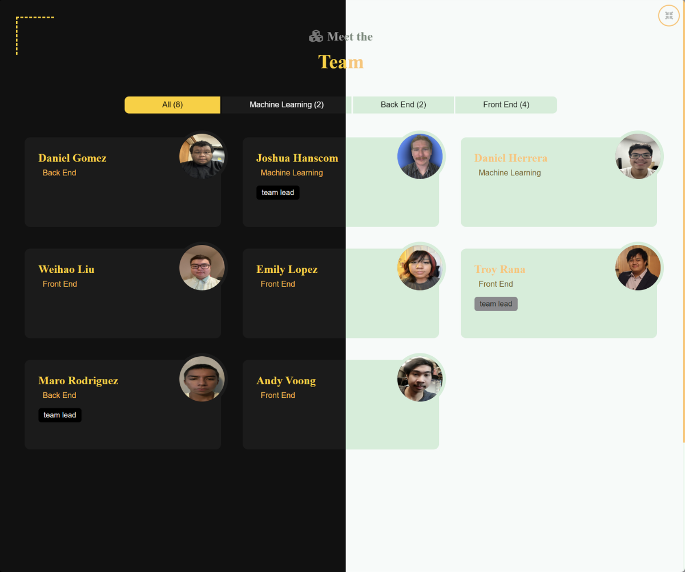
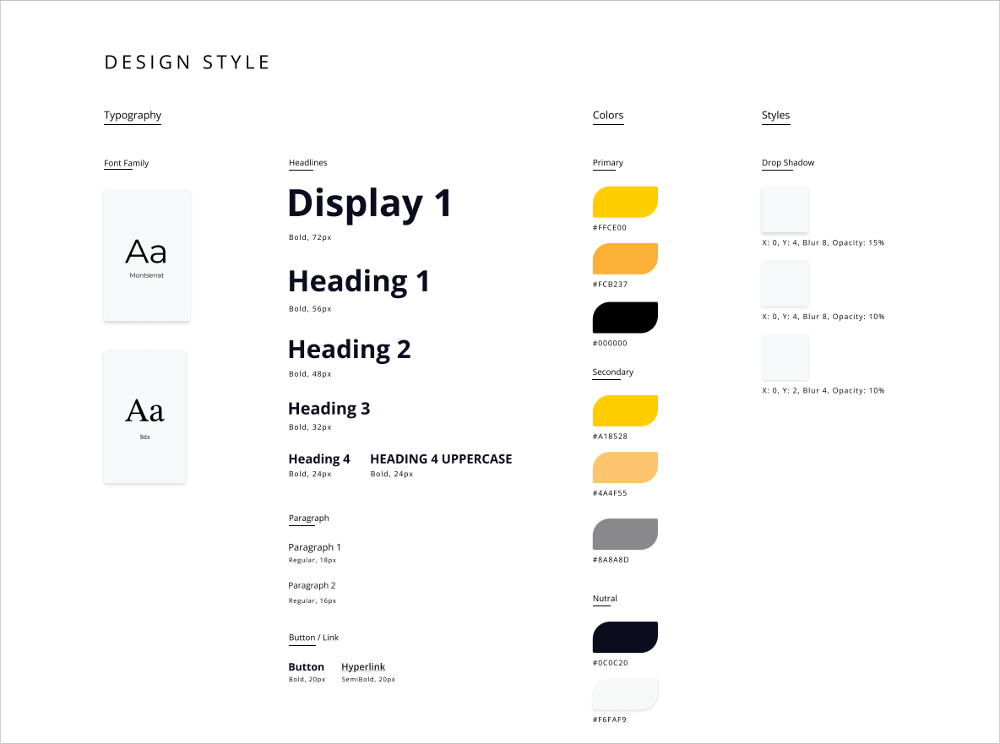
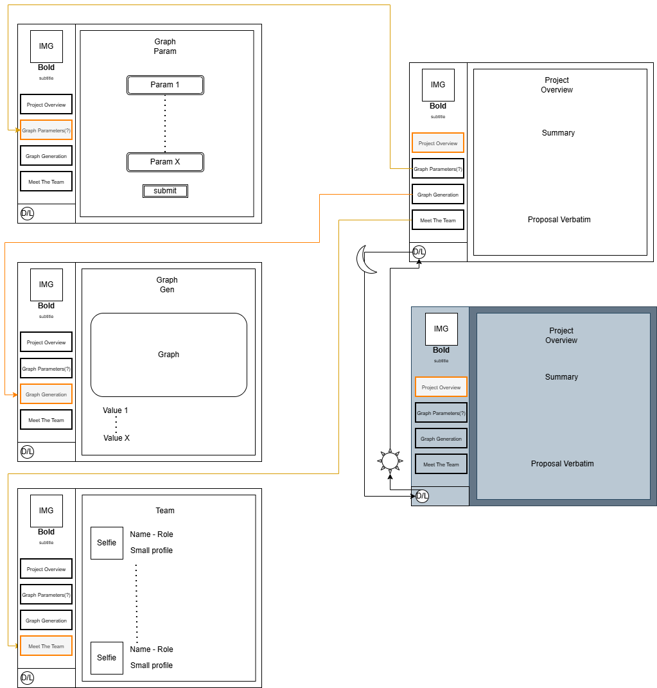

# CSULA Aerospace Senior Design – F10.7 Solar Flux Forecasting

Webpage from modified template for CSULA X Aerospace Senior Design 2025-2026 – built with **React** and **Bootstrap 5**.

<p align="center">
  
</p>


## Component Purpose 
This project is part of the **CSULA Aerospace Senior Design Team (Fall 2025 - Spring 2026)**.  
This repository is meant to work in tandem with the forecast-model and backend repositiories as their frontend page. Working to display data based on user input and formed into 7-day Solar Flux prediction graphs. 


## Getting Started

0. Have Node.js installed on your machine | Follow the instructions found in forecast-back to run backend

```
Google the most recent version and follow the installation wizard.

While the raw webpage can be ran without it all functionality is tied to the backend.
```

1. Clone the repo:
```
git clone https://github.com/csula-aero-25-26/forecast-front
```

2. Go to the project's root folder (forecast-front) and use npm to install all required components:
```
npm install
```

3. Launch the project in developer mode:
```
npm run dev
```

4.  Navigate to page 
```
ctrl+left click link in terminal (will require extra redirection)
or go directly to the following: http://localhost:5173/react-portfolio-template/#overview 
```
* Current itteration runs at localhost as we did not reach deployment.

## Layout & Usage

0. Sidepanel
<p align="center">
  
</p>
[Desc]

1. Landing Page - Overview
<p align="center">
  
</p>
[Desc]

2. Solar Flux - Predictions
<p align="center">
  
</p>
[Desc]

3. Solar Flux - Override 
<p align="center">
  
</p>
[Desc]

4. Solar Flux - Historical & Comparison
<p align="center">
  
</p>
[Desc]

5. Compendium
<p align="center">
  
</p>
[Desc]

6. Meet The Team
<p align="center">
  
</p>
[Desc]

## Active Development
The following is written assuming Forecasting items have not yet been decoupled from Ryan Baliero's template.

1. Creation of an article's .jsx and .scss file can be done automatically with the following
```
npm run resume:make:article Article[Name]
```

## Style Guide
 

## Webpage Diagram
 

## About

This template was modified by and maintained by **Weihao Liu, Emily Lopez, Troy Rana, and Andy Voong**.

The original template was created by and is maintained by **[Ryan Balieiro](https://ryanbalieiro.com/)**. 
The template is based on the **[React](https://reactjs.org/)** framework created by Jordan Walke, and the **[Bootstrap](https://getbootstrap.com/)** framework created by Mark Otto and Jacob Thorton.
