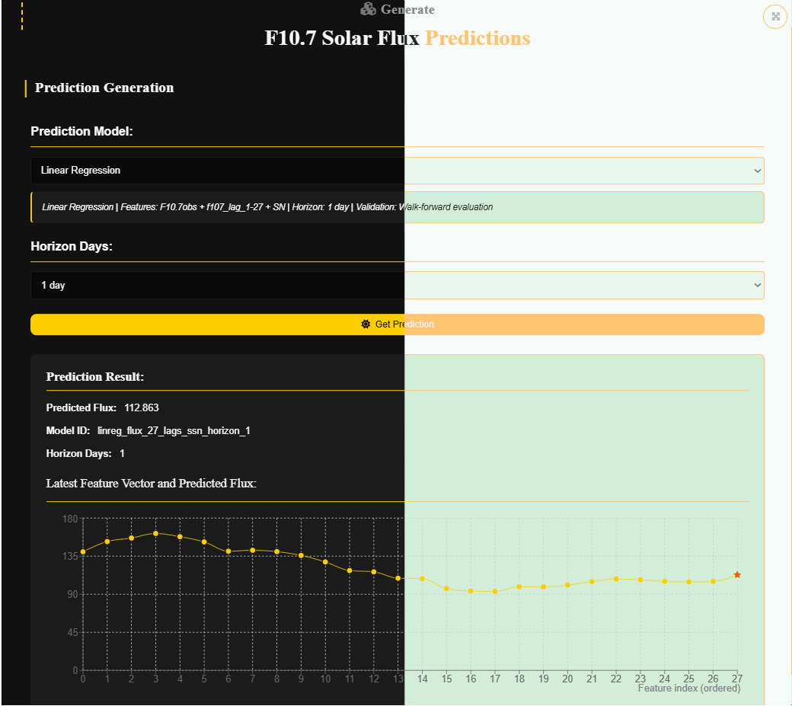
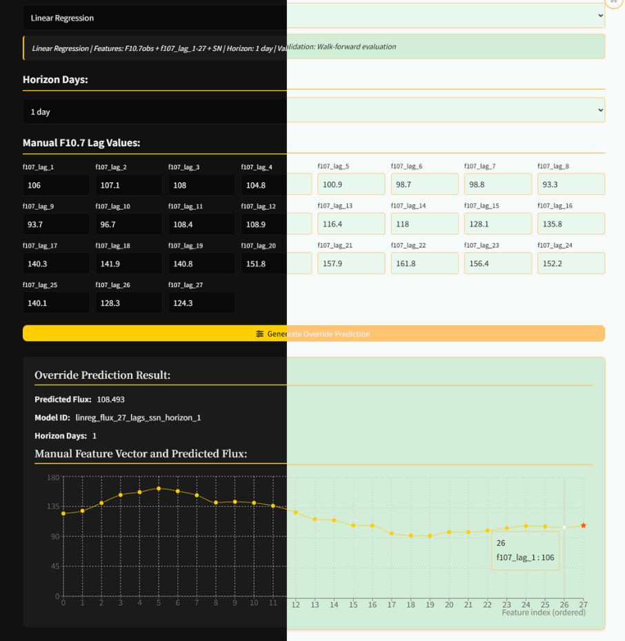
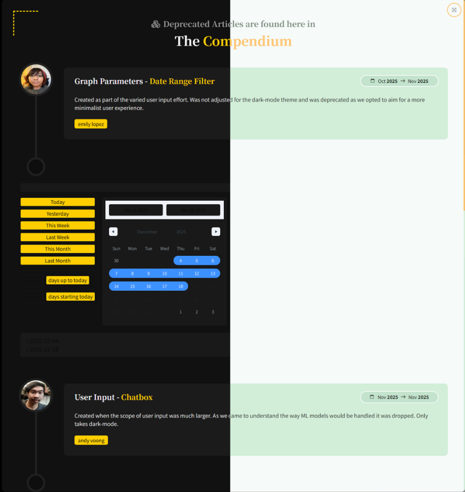

# CSULA Aerospace Senior Design – F10.7 Solar Flux Forecasting

Webpage from modified template for CSULA X Aerospace Senior Design 2025-2026 – built with **React** and **Bootstrap 5**.


## Component Purpose 
This project is part of the **CSULA Aerospace Senior Design Team (Fall 2025)**.  
This repository is meant to work in tandem with the forecast-model and backend repositiories as their frontend page. Working to display data based on user input and formed into 7-day Solar Flux prediction graphs. 


## Getting Started

0. Have Node.js installed on your machine
```
Google the most recent version and follow the installation wizard. 
```

1. Clone the repo:
```
git clone https://github.com/csula-aero-25-26/forecast-front
```

2. Go to the project's root folder and use npm to install all required components:
```
npm install
```

3. Launch the project in developer mode:
```
npm run dev
```

## Layout & Usage

0. Sidepanel


1. Landing Page - Overview
 

2. Solar Flux - Predictions


3. Solar Flux - Override 


4. Solar Flux - Historical & Comparison


5. Compendium


6. Meet The Team


## Style Guide
 

## Webpage Diagram
 

## About

This template was modified by and maintained by **Weihao Liu, Emily Lopez, Troy Rana, and Andy Voong**.

The original template was created by and is maintained by **[Ryan Balieiro](https://ryanbalieiro.com/)**. 
The template is based on the **[React](https://reactjs.org/)** framework created by Jordan Walke, and the **[Bootstrap](https://getbootstrap.com/)** framework created by Mark Otto and Jacob Thorton.
