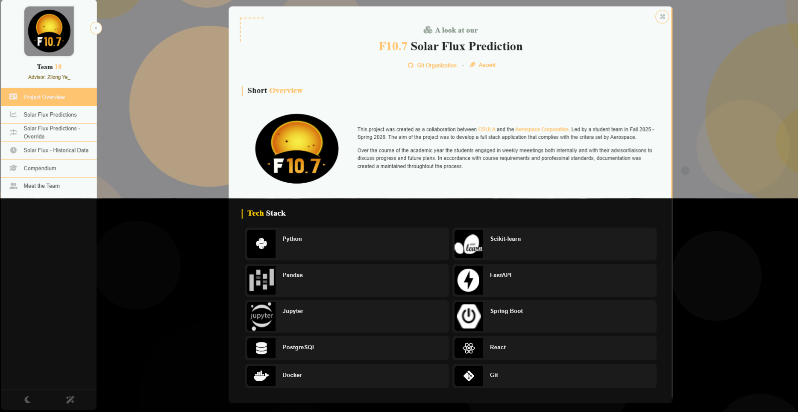
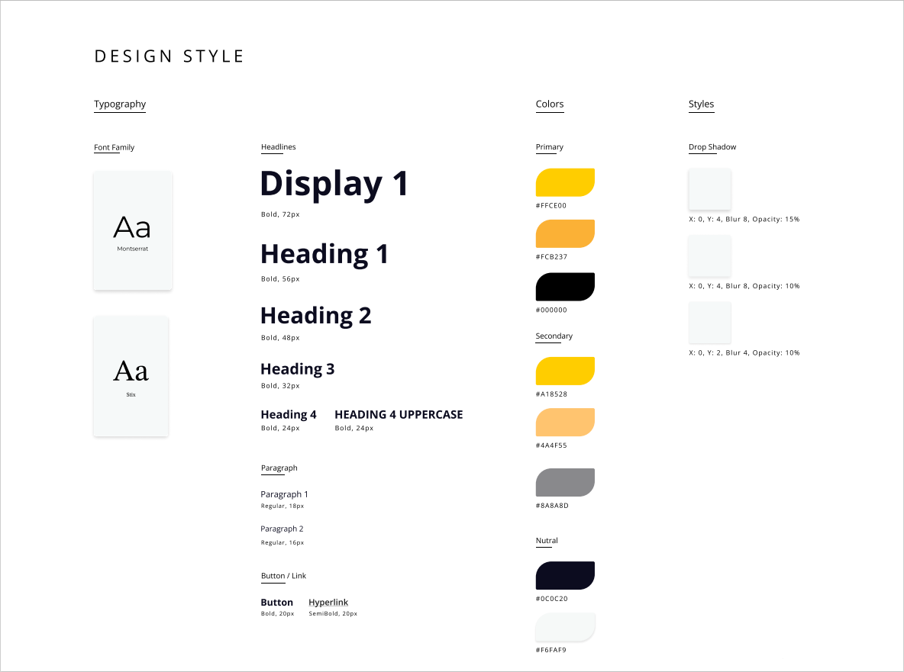

# CSULA Aerospace Senior Design – F10.7 Solar Flux Forecasting

Webpage created from a modified template for the CSULA X Aerospace Senior Design Capstone Fall 2025 - Spring 2026. Built with **React** and **Bootstrap 5**.

<p align="center">
  
</p>


## Component Purpose 
This project is part of the **CSULA Aerospace Senior Design Team (Fall 2025 - Spring 2026)**.  
This repository is meant to work in tandem with the forecast-model and backend repositiories as their frontend page. Working to display data based on user input and formed into 7-day Solar Flux prediction graphs. 


## Getting Started

0. Have Node.js installed on your machine 

```
Google the most recent version and follow the installation wizard.
```

1. Follow the instructions found in forecast-back to run backend
```
While the raw webpage can be ran without it all functionality is tied to the backend.
```

2. Clone the repo:
```
git clone https://github.com/csula-aero-25-26/forecast-front
```

3. Go to the project's root folder (forecast-front) and use npm to install all required components:
```
npm install
```

4. Launch the project in developer mode:
```
npm run dev
```

5.  Navigate to page 
```
ctrl+left click link in terminal (will require extra redirection)
or go directly to the following: http://localhost:5173/react-portfolio-template/#overview 
```
* Current itteration runs at localhost as we did not reach deployment.

## Layout & Usage

Below is the landing page of our frontend split between light and dark modes. For information regarding the functionality of specific sections, navigated to through the sidebar, please refer to the next section



# Component Specifics
<div align="center">

| #    | Section                     | Overview                                                                |
|------|-----------------------------|-------------------------------------------------------------------------|
| 1    | Prediction                  | [See Page](./docs/sectionreadme/prediction.md)                          | 
| 2    | Override                    | [See Page](./docs/sectionreadme/override.md)                            |   
| 3    | Historical                  | [See Page](./docs/sectionreadme/historical.md)                          |  
| 4    | Misc                        | [See Page](./docs/sectionreadme/misc.md)                                |

</div>
* Fair warning: The overviews save the one listed for misc are generated by an LLM and put through QA by a person. 

## Active Development
For specifics to each component's make-up please refer to the overviews in the table above. 

Any general questions that may be tied to the original template, assuming the frontend has not yet been decoupled from it, can be redirected to the **[template repo](https://github.com/ryanbalieiro/react-portfolio-template/)** 

## Style Guide
 

## About

This template was modified by and maintained by **Weihao Liu, Emily Lopez, Troy Rana, and Andy Voong**.

The original template was created by and is maintained by **[Ryan Balieiro](https://ryanbalieiro.com/)**. 
The template is based on the **[React](https://reactjs.org/)** framework created by Jordan Walke, and the **[Bootstrap](https://getbootstrap.com/)** framework created by Mark Otto and Jacob Thorton.
